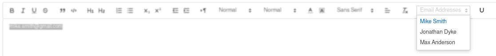

# DynamicQuillTools

DynamicQuillTools is a library that allows you to dynamically add or remove new custom elements to/from a Quill Editor's toolbar. For instance a button or a drop down menu.

## Screenshot

In this screenshot you can see a custom drop down menu and a custom button.



## Live Demo
https://t-vk.github.io/DynamicQuillTools/

## CDN
If you prefer CDNs you can include the library on your website like this:
``` HTML
<script src="https://cdn.jsdelivr.net/gh/T-vK/DynamicQuillTools@master/DynamicQuillTools.js"></script>
```

## Examples
For a full example take a look at [example.html](./example.html).

### Very Basic Example

``` JavaScript
const myButton = new QuillToolbarButton({
    icon: `<svg viewBox="0 0 18 18"> <path class="ql-stroke" d="M5,3V9a4.012,4.012,0,0,0,4,4H9a4.012,4.012,0,0,0,4-4V3"></path></svg>`
})
myButton.onClick = function(quill) {
    alert('You just clicked the button!')
}
myButton.attach(quill) // Add the custom button to the quill editor
```

### Adding a Custom Button

``` JavaScript
const myButton = new QuillToolbarButton({
    icon: `<svg viewBox="0 0 18 18"> <path class="ql-stroke" d="M5,3V9a4.012,4.012,0,0,0,4,4H9a4.012,4.012,0,0,0,4-4V3"></path></svg>`
})
myButton.onClick = function(quill) {
    // Do whatever you want here. You could use this.getValue() or this.setValue() if you wanted.

    // For example, get the selected text and convert it to uppercase:
    const { index, length } = quill.selection.savedRange
    const selectedText = quill.getText(index, length)
    const newText = selectedText.toUpperCase()
    quill.deleteText(index, length)
    quill.insertText(index, newText)
    quill.setSelection(index, newText.length)
}
myButton.attach(quill)
```

### Adding a Custom Drop Down Menu

``` JavaScript
const dropDownItems = {
    'Mike Smith': 'mike.smith@gmail.com',
    'Jonathan Dyke': 'jonathan.dyke@yahoo.com',
    'Max Anderson': 'max.anderson@gmail.com'
}

const myDropDown = new QuillToolbarDropDown({
    label: "Email Addresses",
    rememberSelection: false
})

myDropDown.setItems(dropDownItems)

myDropDown.onSelect = function(label, value, quill) {
    // Do whatever you want with the new dropdown selection here

    // For example, insert the value of the dropdown selection:
    const { index, length } = quill.selection.savedRange
    quill.deleteText(index, length)
    quill.insertText(index, value)
    quill.setSelection(index + value.length)
}

myDropDown.attach(quill)
```


## API Documentation
https://t-vk.github.io/DynamicQuillTools/docs
